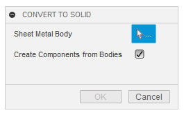
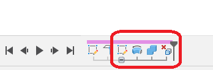
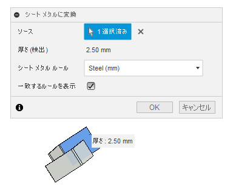

# **Convert To Solid**

This command converts the specified sheet metal body to a solid body.

<u>The documentation is only available in English and Japanese, but the display switches with each Fusion360 language setting.
If the display is inappropriate, please contact us and we will correct it.</u>

---

## **Usage** :

After activation of the add-in, the "Convert to Solid" command will be added within "Sheet Metal" - "Modify".

By clicking on it, a dialog box appears.

+ Sheet Metal Body : Select the sheet metal body to be converted.
  + Sheet metal body for external components is not applicable.

+ Create Component from Bodies: After converting to a solid body, create a new component and move the body into the component. Then exit with the "Convert to Sheet Metal" command dialog displayed.
  - 

---

## **Deliverables** :

The actual process is not a conversion, but the following process.
+ Create a sketch on the flat surface of the sheet metal body.
+ Create solid body with rotate command.
+ Combine to create a solid body.
+ Delete unnecessary bodies.

These processes are made into a timeline group.

※Because a group cannot be created within a timeline group, a group will not be created if it is within a group.

---

## **Note** :

+ None in particular.

---

## **Action** :

The following environment is confirmed.

- Fusion360 Ver2.0.15509
- Windows 10 64bit Pro , Home

---
---

# *** 以下は日本語です。***

# **ソリッドへ変換**
本コマンドは、指定したシートメタルボディをソリッドボディに変換します。

---

## **使用法** :

アドイン起動後は、"シートメタル" - "修正"  内に "ソリッドへ変換" コマンドが追加されます。

クリックする事でダイアログが表示されます。

+ シートメタルボディ : 変換するシートメタルボディを選択してください。
  + 外部コンポーネントのシートメタルボディは対象外です。

+ ボディからコンポーネントを作成 : ソリッドボディに変換後、新たなコンポーネントを作成し、コンポーネント内にボディを移動します。その後"シートメタルに変換"コマンドのダイアログを表示した状態で終了します。
  - 

---

## **成果物** :

実際の処理は変換では無く、以下の処理を行っています。
+ シートメタルボディの平らな面にスケッチを作成。
+ 回転コマンドでソリッドボディを作成。
+ 結合してソリッドボディ化。
+ 不要なボディの削除。

これらの処理をタイムライングループにしています。

※タイムライングループ内にグループを作成出来ない為、グループ内の場合はグループを作成しません。

---

## **注意** :

+ 特にありません。

---

## **アクション** :

以下の環境で確認しています。

- Fusion360 Ver2.0.15509
- Windows10 64bit Pro , Home

---