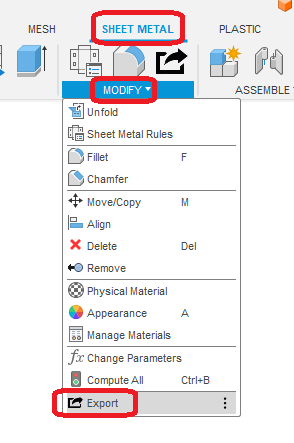
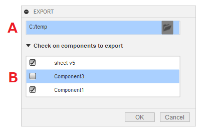
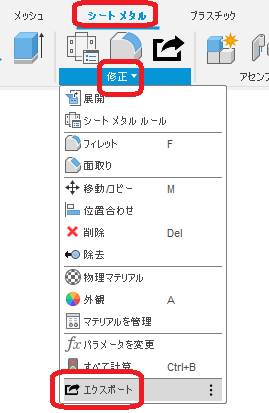

# **Export**

This command exports a DXF of the flat pattern of the active document together.

<u>The documentation is only available in English and Japanese, but the display switches with each Fusion360 language setting.
If the display is inappropriate, please contact us and we will correct it.</u>

---

## **Usage** :

After activation of the add-in, the "Export" command will be added within "Sheet Metal" - "Modify".

By clicking on it, a dialog box will appear.

+ A : Select the destination folder.
+ B : Check the components to be output.
  + A : The components for which flat patterns have been created will be listed.
  + B : Check the components for which a flat pattern has been created.

---

## **Deliverables** :

The file will be exported in the specified folder.
+ The file name will be "component name" + "sheet metal rule name" + "thickness" + extension.
+ If there is already an identical file name, the file name will be "_(number)" in the file name. (It will not be overwritten.)
+ If there is an unsuitable character in the component name, it will be replaced by "_" in the file name.

---

## **Note** :

- Exporting 3D is disabled because it causes Fusion360 to crash.

---

## **Action** :

The following environment is confirmed.

- Fusion360 Ver2.0.15509
- Windows 10 64bit Pro , Home

---
---

# *** 以下は日本語です。***

# **エクスポート**
本コマンドは、アクティブなドキュメントのフラットパターンのDXFをまとめてエクスポートします。

---

## **使用法** :

アドイン起動後は、"シートメタル" - "修正"  内に "エクスポート" コマンドが追加されます。

クリックする事でダイアログが表示されます。

+ A : 出力先のフォルダを選択してください。
+ B : 出力するコンポーネントにチェックを入れます。
  + フラットパターンが作成されているコンポーネントがリストされます。
  + 表示されているコンポーネントについては事前にチェックが入っています。

---

## **成果物** :

指定されたフォルダ内にエクスポートされます。
+ ファイル名は、"コンポーネント名" + "シートメタルルール名" + "厚み" + 拡張子となります。
+ 既に同一のファイル名がある場合は、ファイル名に "_(数値)" のファイル名となります。（上書きしません）
+ コンポーネント名等にファイル名として相応しくない文字がある場合は "_" に置き換えられたファイル名となります。

---

## **注意** :

- 3DのエクスポートはFusion360がクラッシュする為、機能停止。

---

## **アクション** :

以下の環境で確認しています。

- Fusion360 Ver2.0.15509
- Windows10 64bit Pro , Home

---