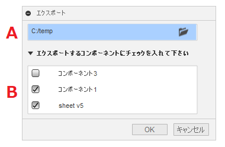

# **エクスポート**

本コマンドは、アクティブなドキュメントのフラットパターンのDXFをまとめてエクスポートします。

---

## **使用法** :

アドイン起動後は、"シートメタル" - "修正"  内に "エクスポート" コマンドが追加されます。

クリックする事でダイアログが表示されます。

+ A : 出力先のフォルダを選択してください。
+ B : 出力するコンポーネントにチェックを入れます。
  + フラットパターンが作成されているコンポーネントがリストされます。
  + 表示されているコンポーネントについては事前にチェックが入っています。

---

## **成果物** :

指定されたフォルダ内にエクスポートされます。
+ ファイル名は、"コンポーネント名" + "シートメタルルール名" + "厚み" + 拡張子となります。
+ 既に同一のファイル名がある場合は、ファイル名に "_(数値)" のファイル名となります。（上書きしません）
+ コンポーネント名等にファイル名として相応しくない文字がある場合は "_" に置き換えられたファイル名となります。

---

## **注意** :

- 3DのエクスポートはFusion360がクラッシュする為、機能停止。

---

## **アクション** :

以下の環境で確認しています。

- Fusion360 Ver2.0.12670
- Windows10 64bit Pro , Home

---