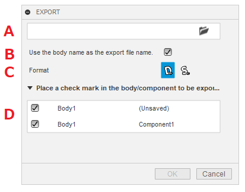
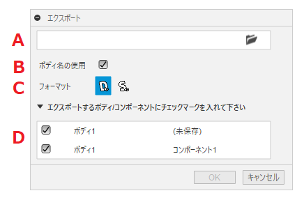

# **Export**

This command creates a flat pattern from the sheet metal body of the active document and exports the DXF together.

<u>The documentation is only available in English and Japanese, but the display switches with each Fusion360 language setting.
If the display is inappropriate, please contact us and we will correct it.</u>

---

## **Usage** :

After activation of the add-in, the "Export" command will be added within "Sheet Metal" - "Modify".

By clicking on it, a dialog box will appear.

+ A : Place a check mark in the body/component to be exported.
+ B : Specify the output format.
  + DXF: Export DXF.
  + SAT: Export SAT. (Bend lines are also exported.)
+ C : Check the components to be output.
  + The sheet metal body and the component name it belongs to will be listed.
  + For the sheet metal body shown, there is a pre-check mark.
  + No need to pre-create flat patterns.
  + Sheet metal bodies in externally linked components are also eligible.
  + This also applies to situations where there are multiple sheet metal bodies within a single component.
---

## **Deliverables** :

The file will be exported in the specified folder.
+ The file name is "body name"-"component name"-"sheet metal rule name"-"thickness" + extension.
+ If there is already an identical file name, the file name will be "_(number)" in the file name. (It will not be overwritten.)
+ If there is an unsuitable character in the component name, it will be replaced by "_" in the file name.
+ Any failed exports will output the file path to a text commands window.

---

## **Note** :

- SAT export is a little unstable.

---

## **Action** :

The following environment is confirmed.

- Fusion360 Ver2.0.15995
- Windows 10 64bit Pro , Home

---
---

# *** 以下は日本語です。***

# **エクスポート**
本コマンドは、アクティブなドキュメントのシートメタルボディからフラットパターンを作成し、DXFをまとめてエクスポートします。

---

## **使用法** :

アドイン起動後は、"シートメタル" - "修正"  内に "エクスポート" コマンドが追加されます。

クリックする事でダイアログが表示されます。

+ A : 出力先のフォルダを選択してください。
+ B : 出力フォーマットを指定してください。
  + DXF: DXFをエクスポートします。
  + SAT: SATをエクスポートします。(ベンドラインもエクスポートします。)
+ C : 出力するボディ/コンポーネントにチェックを入れます。
  + シートメタルボディと所属するコンポーネント名がリストされます。
  + 表示されているシートメタルボディについては事前にチェックが入っています。
  + フラットパターンを事前に作成する必要はありません。
  + 外部リンクのコンポーネント内のシートメタルボディも対象です。
  + 一つのコンポーネント内に複数シートメタルボディがある状態も対象です。

---

## **成果物** :

指定されたフォルダ内にエクスポートされます。
+ ファイル名は、"ボディ名"-"コンポーネント名"-"シートメタルルール名"-"厚み" + 拡張子となります。
+ 既に同一のファイル名がある場合は、ファイル名に "_(数値)" のファイル名となります。（上書きしません）
+ コンポーネント名等にファイル名として相応しくない文字がある場合は "_" に置き換えられたファイル名となります。
+ エクスポートに失敗したものは、テキストコマンドウィンドウにファイルパスを出力します。

---

## **注意** :

- SATのエクスポートが少し不安定。

---

## **アクション** :

以下の環境で確認しています。

- Fusion360 Ver2.0.15995
- Windows10 64bit Pro , Home

---